# Sea ice vs. open water in Sentinel-1 radar images

**One Sentinel-1 radar scene of Arctic sea ice, processed from raw pixel values to an ice / open-water map, and checked
against an independent satellite product.** A learning project, built to understand each step of a standard SAR sea
ice workflow well enough to explain it.

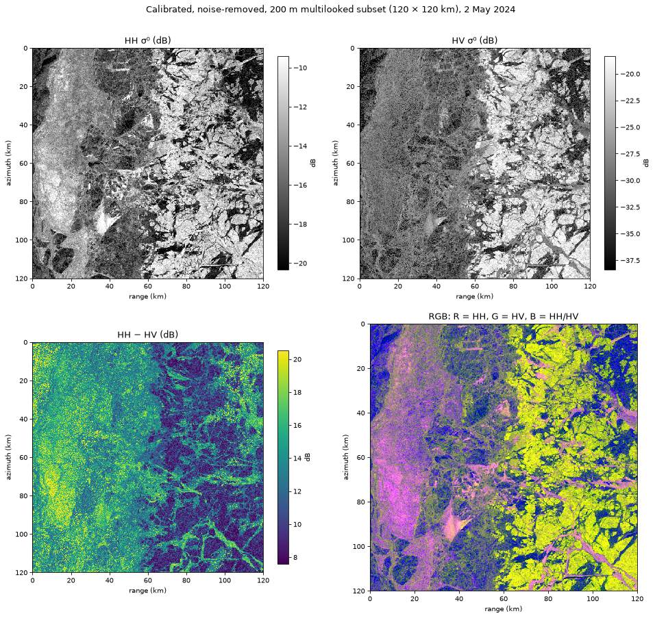
<sub><i>120 × 120 km of sea ice west of Banks Island, Canada, 2 May 2024. Yellow in the RGB = multi-year ice floes;
dark/blue = leads (cracks of open water or thin new ice); pink = young ice or rough water.</i></sub>

## TL;DR

- **Processed** a Sentinel-1 Extra Wide, HH+HV scene: calibration to backscatter (σ⁰), thermal noise removal, dB,
  speckle filtering. Everything runs on a laptop, and only ~40 MB is downloaded.
- **The surprise:** the strongest contrast in this early-May scene is **old ice vs. young ice, not ice vs. water**.
  Algorithms that "just find two groups" (Otsu, k-means with k=2) find the ice types.
- **Dark leads** (open water *or* thin new ice) cover **7.5 %** (threshold) to **15 %** (k-means) of the area.
- An independent passive-microwave product (AMSR2) says **~100 % ice**. The likely reason: most leads had already
  refrozen into thin ice, which looks dark to radar but ice-like to AMSR2.

## Contents

1. [The question](#1-the-question)
2. [SAR in four pictures](#2-sar-in-four-pictures)
3. [The data](#3-the-data)
4. [The pipeline](#4-the-pipeline)
5. [Results, step by step](#5-results-step-by-step)
6. [So how much open water was there?](#6-so-how-much-open-water-was-there)
7. [Limitations](#7-limitations)
8. [Next steps](#8-next-steps)
9. [Run it yourself](#9-run-it-yourself)

---

## 1. The question

Ships, climate models and Arctic communities need to know **where the sea ice is and where the open water is**. The
Arctic is dark for months and often cloudy, so optical satellites often can't see it. **Synthetic Aperture Radar
(SAR)** can: it sends its own microwave pulses and records the echo, day or night, through cloud.

The catch: a radar image is not a photo. Brightness depends on **surface roughness, salt content, internal structure
and viewing angle**, so "ice = bright, water = dark" is only sometimes true. This project explores how far simple
methods get on one real scene.

## 2. SAR in four pictures

### The radar looks sideways

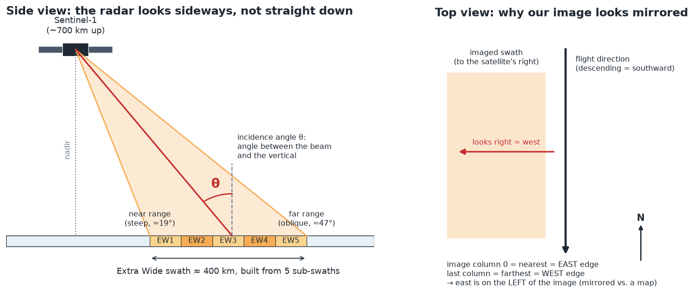

Sentinel-1 looks to its right side, at an angle. The **incidence angle** goes from ≈19° (near range) to ≈47° (far range)
across the 400 km swath, and the same surface looks darker at larger angles. Extra Wide (EW) mode builds the swath from
**5 sub-swaths**, whose seams can show up as stripes. Because this pass flies south and looks west, the raw image is
**mirrored** relative to a map.

### Brightness = how much energy comes back

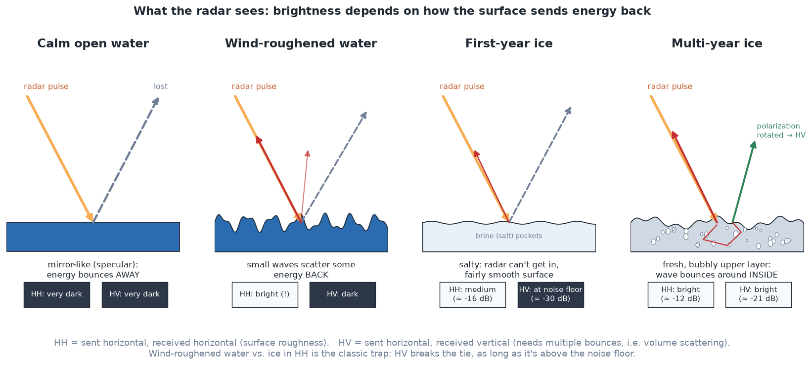

- **HH** (send horizontal, receive horizontal) mostly responds to **surface roughness**.
- **HV** (send horizontal, receive vertical) needs the wave to bounce around and change orientation, which happens
  inside **multi-year ice** (fresh, bubbly) but not in calm *or* windy water.
- That's why HV is the better ice/water channel in principle, **when it is above the noise floor** (next picture).

### The noise floor

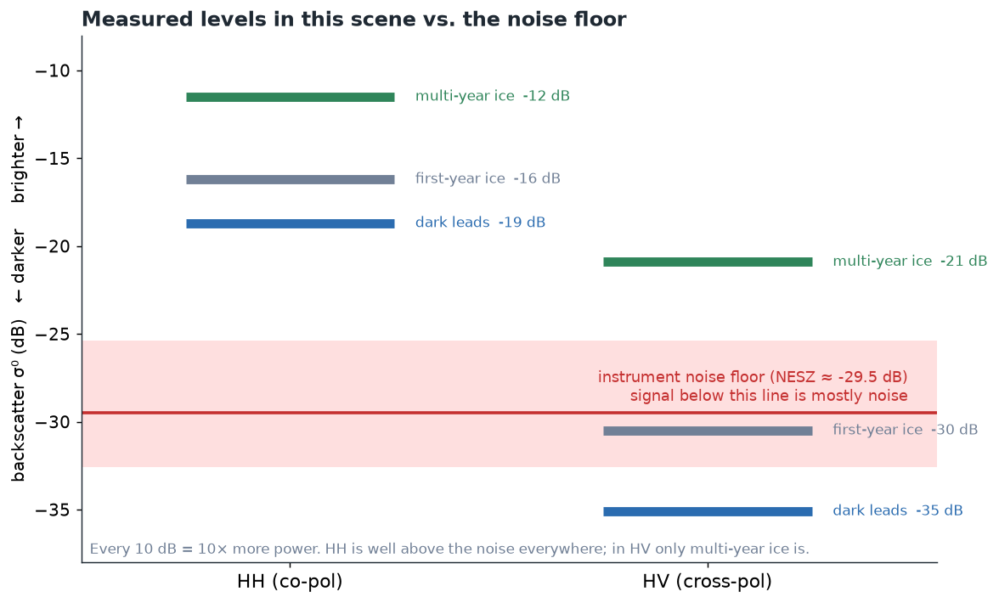

The instrument adds its own **thermal noise**, ≈ −29.5 dB in this scene. HH is far above it. In HV, first-year ice
and leads sit **at or below** the noise, so HV only reliably "sees" multi-year ice here. This one fact explains many
of the difficulties later on.

### Speckle

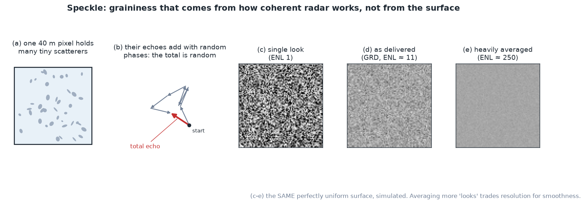

Each pixel contains many small scatterers whose echoes interfere randomly, so even a perfectly uniform surface looks
grainy. Averaging neighbouring pixels ("looks") reduces it, at the cost of resolution. The number of looks a pixel
effectively averages is called the **ENL (equivalent number of looks)**.

## 3. The data

| | |
|---|---|
| **SAR scene** | `S1A_EW_GRDM_1SDH_20240502T152026_20240502T152126_053694_0685B0` |
| When | 2 May 2024, 15:20 UTC, descending pass |
| What | Sentinel-1A, Extra Wide swath, GRD medium resolution (40 m pixels), **HH + HV** |
| Where | Eastern Beaufort Sea, west of Banks Island (NWT, Canada), ~71.5-74.5° N |
| Analysed | a 120 × 120 km subset (3000 × 3000 pixels): flaw lead, pack ice, multi-year floes, no land |
| Source | [Microsoft Planetary Computer](https://planetarycomputer.microsoft.com/dataset/sentinel-1-grd), via the STAC API. **No account needed.** |
| **Reference** | AMSR2 ASI sea ice concentration, 6.25 km daily grid, same date. [University of Bremen](https://seaice.uni-bremen.de/), no account needed |

**Why late April / early May?** Leads are opening, but the snow on the ice is still dry. Once melt starts, wet snow
absorbs the radar signal and ice and water become very hard to tell apart.

**Why Planetary Computer instead of ASF?** Same data. Planetary Computer needs no login and serves Cloud-Optimized
GeoTIFFs, so a subset can be read without downloading the ~1 GB scene. ASF (NASA Earthdata login) is the official archive
and better for bulk downloads.

*Contains modified Copernicus Sentinel data [2024].*

## 4. The pipeline

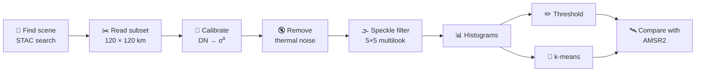

**What calibration does.** The image file stores **DN** (digital numbers): raw amplitudes that depend on the
instrument's settings. Calibration turns them into **σ⁰ (sigma nought)**, the physical fraction of energy sent back per
unit area, comparable across the image and between satellites. All the numbers needed are in XML files that ship with
the product:

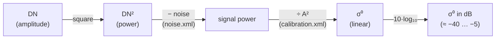

Noise is subtracted and speckle is filtered **before** converting to dB, because both are defined for power. Averaging
in dB would bias the result.

## 5. Results, step by step

### Step 1: the whole scene, and where the subset is

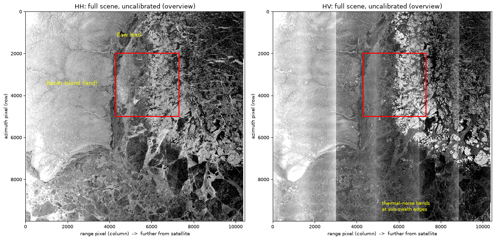

Uncalibrated overview. Banks Island is the bright land on the left; the dark strip along its coast is the **flaw lead**
(the crack between ice frozen to the coast and the drifting pack). The **vertical stripes in HV** are thermal noise at
the sub-swath seams, not real features.

### Step 2: thermal noise removal

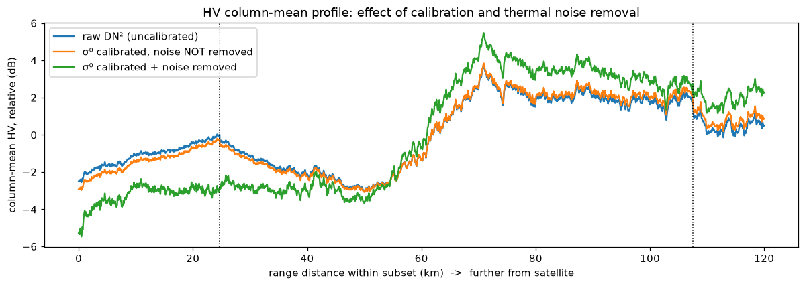

Averaging HV down each column leaves anything that varies across the swath. Before correction, there's a noise
bump at the EW2/EW3 seam (25 km). After correction (green), it's gone. **A ~1.5 dB step remains at the EW3/EW4 seam**
(107 km): ESA's correction is known to leave residuals like this in EW HV.

### Step 3: speckle filtering

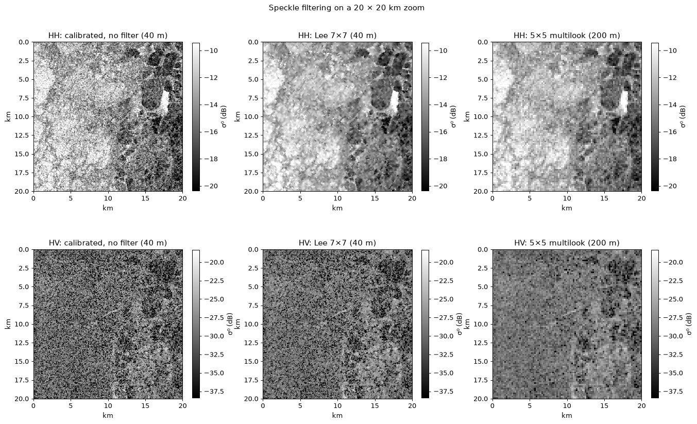

| | No filter | Lee 7×7 | 5×5 multilook (chosen) |
|---|---|---|---|
| HH ENL (higher = smoother) | 6.2 | 17.5 | 17.6 |
| HV ENL | 2.2 | 3.4 | **6.9** |

The Lee filter assumes graininess is speckle (which scales with the signal). In dark HV areas it's mostly **additive
noise** instead, so Lee leaves it alone. Plain block averaging handles both, at the cost of resolution (200 m pixels).

### Step 4: histograms

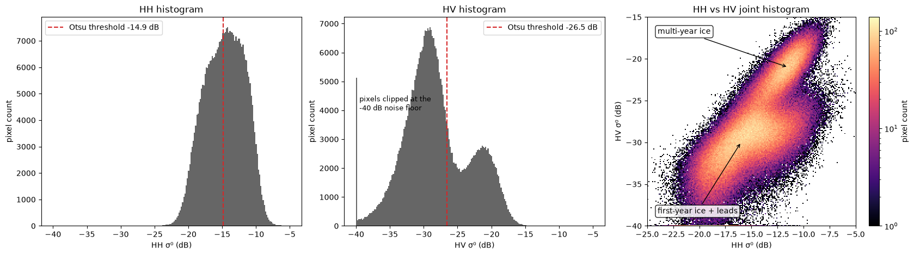

HV has two clear peaks, but they are **multi-year ice (≈ −21 dB) vs. first-year ice + leads (≈ −30 dB)**. HH has
no clean valley at all. Open water / thin ice is only a small dark tail.

### Step 5: classification

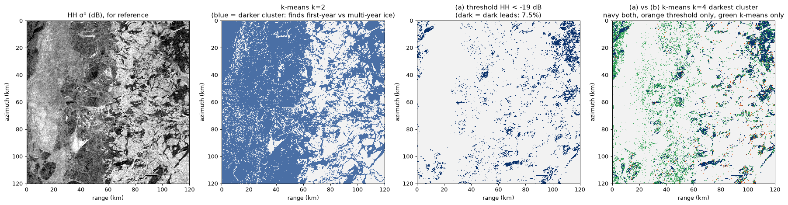

| Method | Labelled "dark leads" | Verdict |
|---|---|---|
| Otsu threshold on HV | 68 % | ❌ found first-year ice, not water |
| k-means, k = 2 | — | ❌ split multi-year from first-year ice |
| **(a) HH < −19 dB** (hand-picked) | **7.5 %** | ✅ clean lead network, but sensitive: 3 % at −20 dB, 15 % at −18 dB |
| **(b) k-means, k = 4**, darkest cluster | **15.1 %** | ⚠️ same leads + darker first-year ice in near range |

(a) and (b) agree on the main leads: 87 % of (a)'s lead pixels are also in (b). Intersection over union is 0.40.

### Step 6: comparison with AMSR2

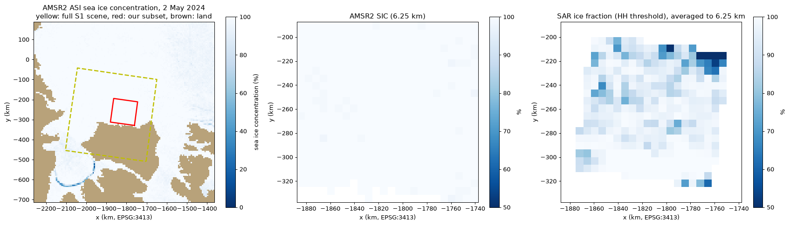

Each 200 m SAR pixel is placed on the map using the image's ground control points, then averaged into AMSR2's 6.25 km cells.

| | Mean ice concentration over 336 cells |
|---|---|
| AMSR2 (passive microwave) | **100 %** (min 98 %) |
| SAR, threshold | 92.9 % (min 37 %) |
| SAR, k-means | 85.8 % (min 22 %) |

## 6. So how much open water was there?

SAR says 7-15 % of the area is dark; AMSR2 says it's all ice. Both can be right:

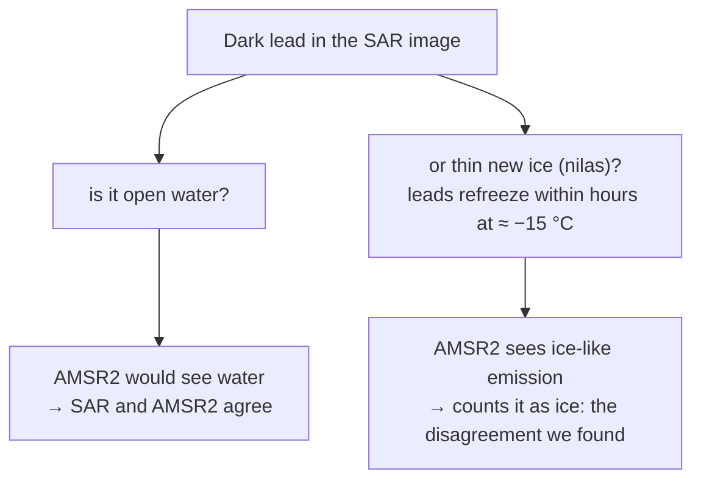

1. **Most leads had likely refrozen.** Thin new ice is smooth and salty, so it's as dark as calm water to C-band
   radar. Its 89 GHz microwave emission becomes ice-like once it's a few centimetres thick, so AMSR2 counts it as ice.
2. **Resolution:** AMSR2 sees several-km footprints; narrow leads are averaged away.
3. **Timing:** SAR is a snapshot; AMSR2 is a daily average.
4. **My own errors:** hand-picked threshold, no incidence-angle correction, k-means over-flagging.

The near-zero correlation (≈ 0.1) mostly reflects that AMSR2 barely varies across the subset. The bias (SAR shows 7-14
points less ice) is the meaningful number. A **Canadian Ice Service chart** (which records ice *stage of development*,
including new ice) would be the natural way to test explanation 1.

## 7. Limitations

- **One scene, one 120 km subset, no ground truth.** Nothing here generalises without more data.
- **Open water vs. thin ice is not separable** with C-band backscatter alone; the "dark leads" class lumps them together.
- **Wind-roughened open water can look like ice in HH.** Little open water was present, so this case wasn't really tested.
- **Hand-picked threshold**: ±1 dB roughly halves or doubles the lead fraction.
- **k-means is unsupervised**: k and the cluster names are human choices.
- **Incidence angle not corrected** (32-40° across the subset), which changes HH by a few dB from left to right.
- **HV is at the noise floor** over first-year ice, with a residual sub-swath step.
- **Geolocation** from ground control points, no terrain correction: fine over flat sea ice at 6.25 km, not survey-grade.

## 8. Next steps

- **Canadian Ice Service charts** for the same week, to test the "refrozen leads" explanation.
- **Incidence-angle normalisation** of HH.
- **Better EW noise correction** (Park et al., 2018; NERSC's `sentinel1denoised`).
- **Texture features** (e.g. GLCM): leads and ice types differ in texture as well as brightness.
- **Supervised deep learning segmentation** trained on the **ESA AI4Arctic Sea Ice Challenge dataset** (Sentinel-1 +
  AMSR2 + ice charts as labels).
- **Multi-scene time series** to follow leads opening and refreezing.

## 9. Run it yourself

Requires [uv](https://docs.astral.sh/uv/) (or Python ≥ 3.12 with `pip install -r requirements.txt`).

```bash
uv sync
uv run jupyter lab notebooks/sea_ice_sar.ipynb      # run all cells
uv run python docs/make_illustrations.py           # optional: redraw the concept pictures
```

The first run downloads ~40 MB into `data/` (gitignored) and takes a few minutes; later runs take about a minute.

```
├── notebooks/sea_ice_sar.ipynb   # the full analysis, top to bottom
├── figures/                      # figures produced by the notebook
├── docs/
│   ├── make_illustrations.py     # draws the concept pictures
│   └── img/                      # concept pictures used above
├── data/                         # downloaded data (gitignored, never committed)
├── pyproject.toml / uv.lock      # pinned dependencies
└── requirements.txt              # same, for pip
```

## What I learned

### SAR fundamentals

### Calibration and noise

### Speckle

### Sea ice in SAR

### Classification and validation

### What surprised me

## A note on how this was built

I built this project with AI assistance (Claude) while learning the domain: it helped write and debug the code and
explained the concepts as we went. The "What I learned" section is written by me.

## References

- ESA, *Sentinel-1 Level-1 Detailed Algorithm Definition*, and *Thermal Denoising of Products Generated by the Sentinel-1 IPF* (MPC-0392).
- Lee, J.-S. (1980). Digital image enhancement and noise filtering by use of local statistics. *IEEE TPAMI*, 2(2).
- Otsu, N. (1979). A threshold selection method from gray-level histograms. *IEEE Trans. SMC*, 9(1).
- Spreen, G., Kaleschke, L., Heygster, G. (2008). Sea ice remote sensing using AMSR-E 89-GHz channels. *JGR*, 113, C02S03.
- Park, J.-W., Korosov, A., Babiker, M., et al. (2018). Efficient thermal noise removal for Sentinel-1 TOPSAR cross-polarization channel. *IEEE TGRS*, 56(3).
